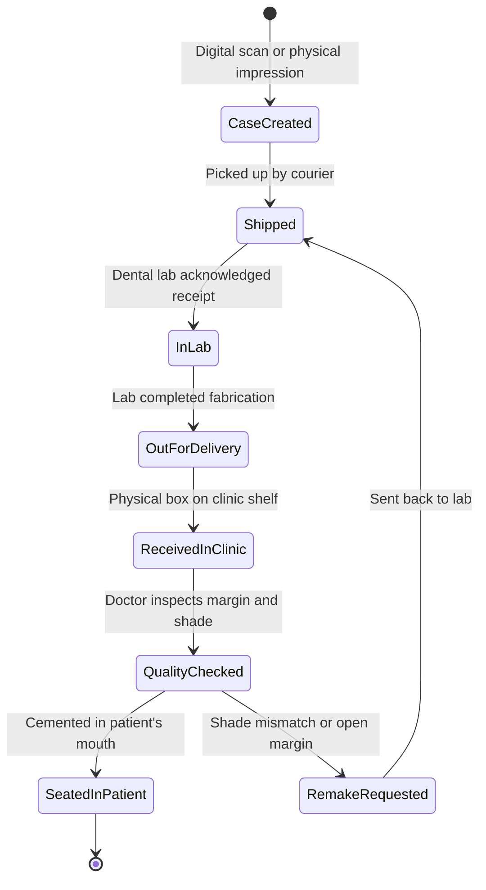

# Dental Clinic ERP: Domain Engineering Specification

This document details the clinical, operational, and financial workflows unique to dental medicine. It serves as the primary domain reference when designing database schemas, API contracts, and user interface components.

---

## The Core Problem: Why General Medical & Business ERPs Fail in Dentistry

General hospital software (EHRs like Epic, Cerner) and general business ERPs (SAP, Odoo, ERPNext) fail in dental clinics because they make invalid domain assumptions:

| Dimension | General Medical / General ERP Assumption | Dental Clinic Reality |
| :--- | :--- | :--- |
| **Primary Entity** | Diagnostic encounter or physical patient chart. | **Tooth-anchored anatomical grid (Odontogram)** with 32 permanent / 20 primary teeth and 5 surfaces each. |
| **Scheduling** | By Doctor / Physician. | **By Operatory (Chair) + Doctor + Assistant**. One dentist frequently operates across 2–3 chairs simultaneously. |
| **Manufacturing / Lab** | Internal pharmacy or central sterile store. | **External custom prosthetics** (crowns, bridges, aligners) manufactured by third-party dental labs with strict logistics turnarounds. |
| **Inventory** | Scanned at point-of-sale or ward dispensary. | **Auto-depleted via procedure recipes (BOM)**. Clinicians in sterile gloves cannot scan barcodes during surgery. |
| **Revenue Model** | Urgent / acute care, insurance-driven. | **Phased elective care and case presentation** requiring patient financial acceptance, co-pays, and recurring 6-month hygiene recalls. |

---

## Pillar 1: The Odontogram (Tooth Charting Engine)

The Odontogram is the interactive visual representation of the patient's oral cavity. Almost every clinical note, treatment plan, and invoice line item stems from this component.

### 1.1 Tooth Numbering Systems

A plug-and-play ERP must support multiple numbering standards configurable per clinic tenant:

```
                  Upper Right (UR / Quad 1)    |    Upper Left (UL / Quad 2)
       FDI:          18 17 16 15 14 13 12 11   |   21 22 23 24 25 26 27 28
       Universal:     1  2  3  4  5  6  7  8   |    9 10 11 12 13 14 15 16
       Deciduous:       55 54 53 52 51         |      61 62 63 64 65
       ----------------------------------------+----------------------------------------
       Deciduous:       85 84 83 82 81         |      71 72 73 74 75
       Universal:    32 31 30 29 28 27 26 25   |   24 23 22 21 20 19 18 17
       FDI:          48 47 46 45 44 43 42 41   |   31 32 33 34 35 36 37 38
                  Lower Right (LR / Quad 4)    |    Lower Left (LL / Quad 3)
```

1. **FDI Two-Digit Notation (ISO 3950)**: Standard in Ethiopia, Europe, Latin America, and Asia.
   - First digit = Quadrant (1 = Upper Right, 2 = Upper Left, 3 = Lower Left, 4 = Lower Right; Primary teeth use 5, 6, 7, 8).
   - Second digit = Tooth position from midline (1 = Central Incisor, 8 = Third Molar).
2. **Universal Numbering System**: Standard in the United States.
   - Numbers 1–32 starting from Upper Right Third Molar clockwise to Lower Right Third Molar. Primary teeth use letters A–T.
3. **Palmer Notation**: Common in Orthodontics worldwide (quadrant brackets with numbers 1–8).

> **Architectural Decision**: Store teeth using a neutral internal identifier (e.g. permanent index `1` to `32` or enum `PERM_UR_8` down to `PERM_LR_8`). Transform to FDI or Universal notation dynamically at the view layer based on the tenant's configuration.

### 1.2 Surface-Level Topology

Each tooth has 5 distinct anatomical surfaces:
- **M (Mesial)**: Surface facing toward the dental midline.
- **D (Distal)**: Surface facing away from the dental midline.
- **O (Occlusal)**: Chewing surface of posterior teeth (Molars & Premolars) / **I (Incisal)**: Cutting edge of anterior teeth (Incisors & Canines).
- **B (Buccal / Facial)**: Surface facing the cheeks/lips.
- **L (Lingual / Palatal)**: Surface facing the tongue (lower) or roof of mouth (upper).

*Significance*: A restoration fee and material quantity depend directly on surfaces involved (e.g., single-surface `O` vs. two-surface `MO` vs. three-surface `MOD` composite filling).

### 1.3 The 4 Temporal States of an Odontogram Element

Every tooth condition in the database must carry a lifecycle status:

| State | Color Code | Description |
| :--- | :--- | :--- |
| **Existing Prior** | Gray / Green | Restorations, root canals, or missing teeth done by other clinics before patient came to Lewi. |
| **Diagnosed (Pathology)** | Red | Active decay (caries), fractured cusp, periapical lesion, or periodontal pocket needing treatment. |
| **Treatment Planned** | Blue | Approved or proposed procedure staged for future visits. |
| **Completed** | Solid Fill / Navy | Procedure performed and completed at this clinic. Generates ledger billing line. |

---

## Pillar 2: Operatory (Chair-Centric) Scheduling

In dentistry, the primary constraint is not doctor availability—it is the **Operatory (Dental Chair)** and physical equipment (air compressor, suction, delivery unit).

### 2.1 Multi-Chair Staggered Booking

A single dentist frequently oversees 2 or 3 chairs with the assistance of dental nurses and hygienists:

```
Time      Chair 1 (Operatory A)                Chair 2 (Operatory B)
09:00     Patient A: Infiltration anesthesia   [Nurse prepping tray & sterilizing]
09:15     Patient A: Waiting for numbness      Patient B: Seated, Dr. Eyuel tooth prep
09:35     Patient A: Dr. Eyuel drilling        Patient B: Taking alginate impression
09:55     Patient A: Nurse placing band        Patient B: Dismissed, disinfection
```

### 2.2 Schedule Entity Requirements
- **Chair / Operatory ID**: Primary calendar resource column.
- **Provider Time vs. Chair Time**:
  - `durationMinutes`: Total chair reservation.
  - `providerMinutes`: Dedicated dentist presence required.
- **Procedure Pre-requisite Checks**: Warn reception if booking a restorative visit before hygiene cleaning, or booking crown fitting before the dental lab delivers the prosthetic.

---

## Pillar 3: Phased Treatment Planning & Case Acceptance

Because dental treatment can exceed patient immediate budgets, care is structured into sequential clinical phases.

### 3.1 Clinical Phasing Standard
1. **Phase 1: Urgent / Emergency**: Pain relief, acute infection drainage, emergency extraction, pulpotomy.
2. **Phase 2: Disease Control**: Full-mouth scaling/root planing (perio), cavity excavation, stabilizing temporary fillings.
3. **Phase 3: Reconstruction / Rehabilitation**: Endodontics (RCT), crown & bridge prosthetics, dental implants, surgical grafts.
4. **Phase 4: Maintenance & Cosmetics**: Clear aligners / braces, in-office whitening, veneers, 6-month recall schedule.

### 3.2 The Case Presentation Pipeline
The ERP must track treatment proposals through an acceptance funnel:
$$\text{Draft Plan} \longrightarrow \text{Presented to Patient} \longrightarrow \text{Accepted (Signed)} \longrightarrow \text{In Progress} \longrightarrow \text{Completed}$$

- When a phase is **Accepted**, appointments can be scheduled and partial deposits taken.
- Unaccepted plans remain in a tracking pipeline for follow-up patient recall calls.

---

## Pillar 4: External Dental Lab Logistics Tracking

Dentists do not make crowns, bridges, dentures, or surgical guides in the operatory; they outsource to specialized dental fabrication labs.

### 4.1 Lab State Machine



### 4.2 Critical Rule: Seating Lockout
The appointment scheduler must **prevent or hard-warn** when booking a patient for a "Crown Fitting / Bridge Seating" procedure unless the associated Lab Slip is in `ReceivedInClinic` or `QualityChecked` status.

---

## Pillar 5: Procedure-Linked Inventory Auto-Depletion (BOM)

Clinicians cannot pause surgical procedures to scan inventory barcodes. The ERP links each procedure code to a Bill of Materials (BOM) recipe:

### Example Recipe: Root Canal Therapy (`RCT-MOLAR`)
- 2x Carpules Lidocaine 2% with 1:100k Epinephrine
- 1x Sterile Disposable 27G Long Needle
- 1x Rubber Dam Sheet (Latex or Nitrile)
- 1x Rotary Endo NiTi File Set
- 3x Gutta-Percha Points (#25, .04 taper)
- 1x AH Plus Sealer Syringe Unit (0.2ml)
- 1x Temporary Cavit Restorative Material (0.5g)

When the dentist clicks **"Mark Procedure Completed"**, the backend atomically generates `StockMovement` records of type `DISPENSED` for each recipe item, deducting stock from the operatory's assigned storage cabinet.

---

## Pillar 6: Automated Hygiene Recall Engine

Dentistry relies on predictable preventative visits every 3 to 6 months.

### 6.1 Automated Lifecycle
1. When an appointment is marked `COMPLETED`:
   $$\text{Recall Due Date} = \text{Appointment Date} + 180 \text{ Days (6 Months)}$$
2. **$T - 14$ Days**: Automated notification (via Telegram or WhatsApp) prompting patient to schedule.
3. **$T - 2$ Days**: Reminder with direct confirmation deep-link.
4. **$T + 30$ Days (Overdue)**: Flagged in front-desk "Follow-up Due" call queue.
