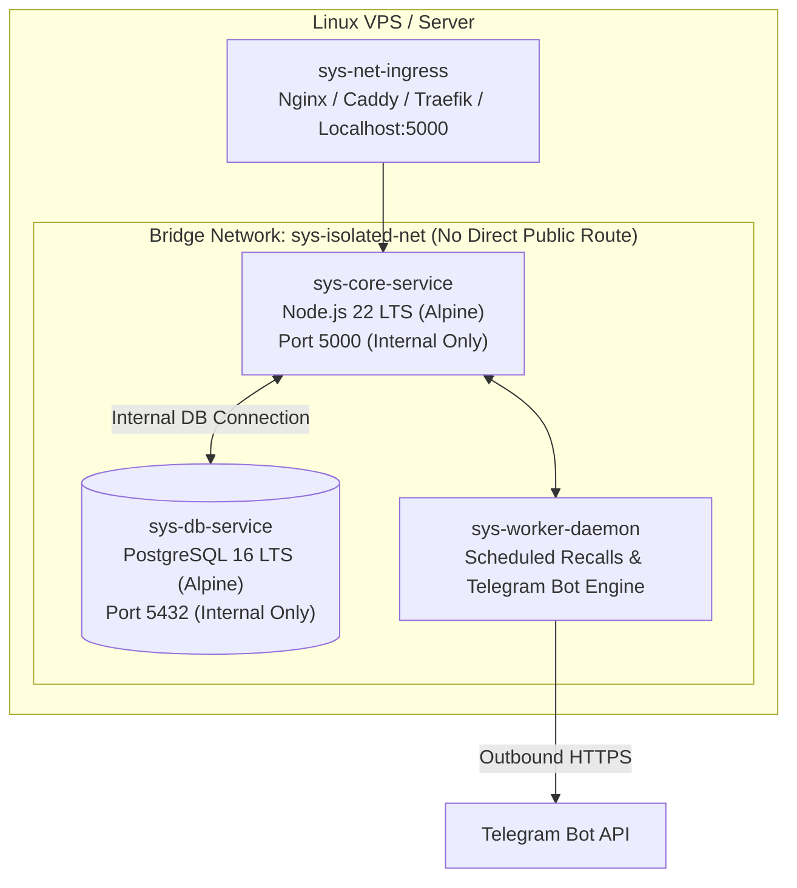

# Backend Architecture & Security Specification

This document details the containerized architecture, database layer, generic Linux service topology, Scoped Role-Based Access Control (Scoped RBAC), and Telegram notification engine for the plug-and-play Dental Clinic ERP.

---

## 1. System Topology & Container Isolation

To ensure complete isolation on a VPS or bare-metal Linux server, the system runs inside an isolated Docker bridge network. No database ports are exposed to the external host network.



### 1.1 Service Naming Conventions (Generic Linux)
For privacy, compliance, and multi-tenant security on shared/dedicated infrastructure, all units, volumes, and containers use generic Linux service identifiers:

| Component | Identifier | Base Image | Notes |
| :--- | :--- | :--- | :--- |
| **API Runtime** | `sys-core-service` | `node:22-alpine` (LTS) | Multi-stage build, unprivileged `node` user |
| **Database** | `sys-db-service` | `postgres:16-alpine` (LTS) | Persistent Docker volume `sys-db-data` |
| **Network** | `sys-isolated-net` | Bridge (Internal) | Isolated container-to-container DNS |
| **Worker Engine**| `sys-worker-daemon`| Integrated / In-Process | Cron for 6-month recalls & Telegram queue |

---

## 2. Authorization Architecture: Scoped RBAC

To avoid the maintenance trap of hundreds of atomic permission strings (`patients.view`, `patients.edit`, `billing.manage`), access control is organized into **5 core clinic domains** with an **Ownership Scope**.

### 2.1 The 4 Scope Levels
- **`none` (0)**: Domain is completely inaccessible and hidden from UI.
- **`read` (1)**: Clinic-wide read-only access (e.g. nurse viewing daily schedule).
- **`own` (2)**: Can read all clinic records, but can only create or edit records **assigned to this provider** (essential for dentists working on their own patients and charts).
- **`all` (3)**: Full administrative and modification authority for this domain.

### 2.2 Default Role Profiles

| Role | `patients` | `clinical` | `scheduling` | `billing` | `inventory` | Description |
| :--- | :---: | :---: | :---: | :---: | :---: | :--- |
| **`ADMIN`** | `all` | `all` | `all` | `all` | `all` | Practice Owner / Clinic Director |
| **`DENTIST`** | `read` | `own` | `own` | `none` | `read` | Clinical chart, tooth notes, own chair schedule |
| **`RECEPTION`** | `all` | `none` | `all` | `read` | `none` | Front desk intake, patient registration, calendar |
| **`CASHIER`** | `read` | `none` | `read` | `all` | `none` | Invoice generation, payments, register close |
| **`NURSE`** | `read` | `none` | `read` | `none` | `all` | Tray preparation, inventory stocking, check-in |

### 2.3 Backend Query Implementation Pattern
Backend service methods inject ownership filters dynamically based on user context:

```typescript
// Reusable query scope injector
export function applyScopeFilter(domain: string, user: AuthenticatedUser, field = 'dentistId') {
  const scope = user.scopes[domain];
  if (scope === 'none') throw new ForbiddenException('Access denied to domain: ' + domain);
  if (scope === 'all' || scope === 'read') return {};
  if (scope === 'own') return { [field]: user.id };
  return { id: '__DENIED__' };
}
```

---

## 3. Telegram Bot Notification Engine

Because international or local SMS APIs frequently experience deliverability issues, cost barriers, or regulatory hurdles, the ERP embeds an automated **Telegram Bot Engine** as a primary communication channel.

### 3.1 Patient Workflow & Deep Linking
1. **Frictionless Binding**:
   - Each registered patient has a unique token generated: `PT-8421`.
   - The clinic prints a QR code or sends a link: `https://t.me/LewiClinicBot?start=pt_8421`.
   - Patient clicks Start in Telegram; the bot binds `telegramChatId` to patient `PT-8421` in PostgreSQL.
2. **Automated Patient Triggers**:
   - **Booking Confirmation**: Instant confirmation with appointment date, time, dentist, and clinic location.
   - **Pre-Visit Reminder**: Automated notice 24 hours and 2 hours prior to chair time.
   - **Payment Receipt**: Digital receipt with Telebirr/Bank transaction reference and remaining balance.
   - **Hygiene Recall**: 6-month recall invitation with one-tap booking.

### 3.2 Clinic Staff Operational Channel
The bot connects to a private clinic staff group / channel for real-time operational alerts:
- **Low Stock Alert**: Triggered when consumables drop below `minQty` (alerts Nurse & Admin).
- **Emergency Walk-in**: Notifies on-duty dentists when a triage emergency is marked.
- **End-of-Day Cashier Close**: Sends total revenue breakdown (Cash, Telebirr, CBE, Card) to the Clinic Director upon register closing.

---

## 4. Multi-Tenant Data Isolation Strategy

To support multiple dental clinics out of a single codebase:
1. Every core database table carries a `tenantId` column (e.g. `lewi-bole`, `dr-salem-clinic`).
2. Global Prisma middleware enforces `tenantId = req.tenantId` on all reads, writes, and updates.
3. System settings table stores tenant configurations:
   - Currency (`ETB`, `USD`, `EUR`)
   - Notation system (`FDI` vs. `UNIVERSAL`)
   - Working hours and operatory chair count
   - Localized payment methods (e.g., Telebirr, CBE, Awash Bank, M-Pesa, Stripe)
