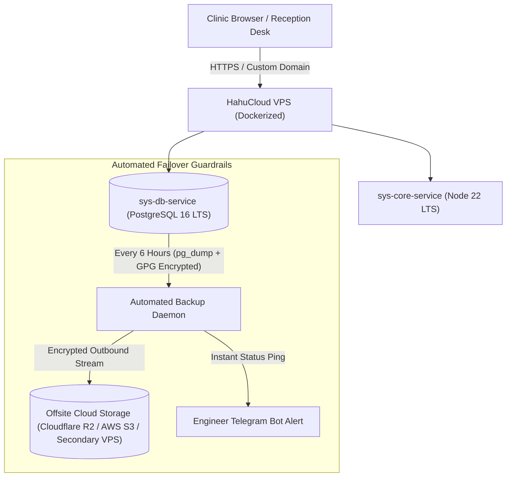

# Dental ERP Monetization & Infrastructure Strategy (Ethiopian Market Reality)

A pragmatic commercial and infrastructure roadmap adapted for private dental clinics in Ethiopia, incorporating solo-engineer operational realities, managed cloud hosting (HahuCloud), failure guardrails, and custom pricing models.

---

## 1. The Realities on the Ground in Ethiopia

### Reality 1: Clinic Software Maturity & The "Reports Hook"
- Most private dental clinics in Addis Ababa and regional hubs are transitioning from paper logbooks, manual receipt books, or fragmented Excel spreadsheets.
- **The Core Value Driver**: Clinic directors care most about **financial reporting, cashier reconciliation, and preventing revenue leakage** (e.g., verifying if the ETB 4,500 collected for a root canal was properly recorded via Telebirr/cash or went missing).
- While clinical charting (Odontogram) is valuable, the **financial and operational reports are the Day 1 selling hook** that justifies the purchase.

### Reality 2: Why On-Premise Mini-Servers are a Trap for Solo Engineers
- Setting up physical mini-PCs or local servers inside clinics in Addis Ababa requires physical travel through traffic for every minor issue (power surges, corrupted Windows registries, accidental unplugging, staff spilling coffee on the box).
- For a **solo engineer / small team**, physical on-site infrastructure does not scale.
- **The Solution**: Fully managed Linux VPS instances hosted centrally (e.g., on **HahuCloud VPS**), eliminating on-site hardware trips and allowing instant remote monitoring, container upgrades, and centralized troubleshooting.

---

## 2. Guardrails Against Single-Point-of-Failure (SPOF)

Hosting on local cloud infrastructure (HahuCloud) is efficient, but requires strict defensive engineering against VPS outages:

### The 3 Essential Guardrails:
1. **Automated Encrypted Offsite Snapshots**:
   - Every 6 hours, an automated script runs `pg_dump`, encrypts the archive with AES-256 (GPG), and pushes it outside HahuCloud to an offsite S3-compatible bucket (e.g. Cloudflare R2 or Backblaze B2, costing cents per month).
   - If the HahuCloud VPS is wiped or destroyed, a replacement VPS can restore the full clinic state in **under 10 minutes**.
2. **Self-Healing Docker Containers**:
   - Containers use `restart: unless-stopped` with health checks.
   - If Node.js runs out of memory or crashes, Docker restarts it in 2 seconds without human intervention.
3. **Automated Heartbeat Bot**:
   - A lightweight external health pinger checks the clinic's `/api/health` every 5 minutes. If it ever goes down, the engineer receives an immediate Telegram alert before the clinic even notices.

---

## 3. Commercial Package & Pricing Architecture

The pricing structure is tailored to the clinic’s psychology and cash flow:

### 1. The Initial Deployment & Onboarding Package: **ETB 80,000 (One-Time)**
- **What is included:**
  - Full deployment of the dedicated, isolated clinic Docker instance on the managed VPS.
  - Initial configuration of clinic profile, fee schedule (procedure prices in ETB), and staff accounts (Dentists, Receptionists, Cashiers).
  - Data import (migrating existing patient records from Excel / paper ledgers).
  - Hands-on staff training:
    - Reception: booking, check-in, search.
    - Dentists: tooth charting and clinical procedure logging.
    - Cashier: Telebirr/CBE payment processing, daily drawer close.
  - Custom branded Telegram Bot setup for the clinic.

### 2. Managed Hosting & Infrastructure: **ETB 2,000 / Month**
To eliminate monthly collection friction, hosting is collected in **lump-sum installments**:
- **3-Month Installment**: ETB 6,000
- **6-Month Installment**: ETB 12,000
- **12-Month Installment (Annual)**: ETB 24,000 (preferred for budgeting)
*Paid via CBE Corporate Bank Transfer or Telebirr.*

### 3. Software Assurance & Maintenance (Annual Contract)
- Covers continuous system updates, compliance updates, database integrity checks, automated offsite backup storage, and priority engineer hotline support.
- Configurable per clinic tier (e.g. standard maintenance included with hosting installment, or premium on-call SLA).

---

## 4. Financial Projections (Solo Engineer & Team)

| Metric | Phase 1 (First 5 Clinics) | Phase 2 (15 Clinics) | Phase 3 (30 Clinics) |
| :--- | :--- | :--- | :--- |
| **Upfront Setup Revenue** (ETB 80k / clinic) | **ETB 400,000** | **ETB 1,200,000** | **ETB 2,400,000** |
| **Recurring Hosting (ETB 24k / clinic / year)** | **ETB 120,000 / yr** | **ETB 360,000 / yr** | **ETB 720,000 / yr** |
| **Infrastructure Costs (HahuCloud VPS)** | ~ETB 25,000 / yr | ~ETB 60,000 / yr | ~ETB 120,000 / yr |
| **Net Operational Cash Flow** | **~ETB 495,000** | **~ETB 1,500,000** | **~ETB 3,000,000** |

This structure gives your team healthy immediate cash to fund development, while building a rock-solid recurring income base with minimal infrastructure cost.
